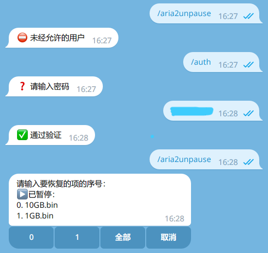
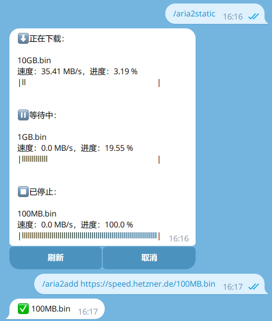
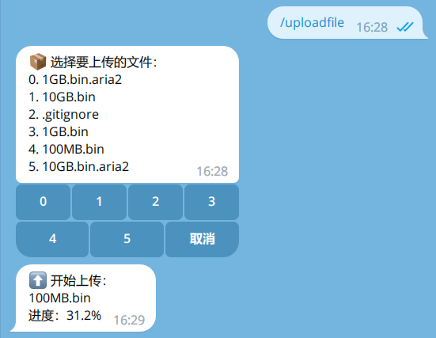
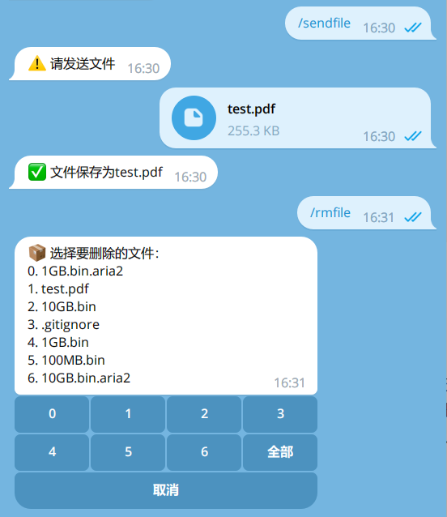
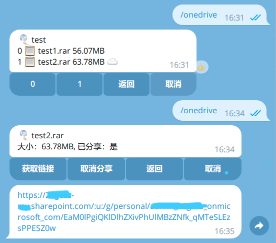
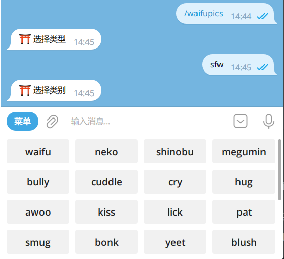

# mypybot

使用Python编写的自用Telegram机器人，基于[pyTelegramBotAPI](https://github.com/eternnoir/pyTelegramBotAPI)

## 安装

```bash
python3 -m venv venv
source venv/bin/activate
pip install -r requirements.txt
python main.py
```

## Telegram Api设置代理

在`main.py`文件开头加入：

```python
from telebot import apihelper
apihelper.proxy = {'http': 'http://127.0.0.1:108', 'https': 'http://127.0.0.1:108'}
```

`http://127.0.0.1:108`为代理地址

## 功能

已实现：

* Aria2管理（添加、暂停、恢复、删除下载，显示进度）
* 指定文件夹内文件的接收、删除、上传Onedrive
* Onedrive文件的浏览、分享、取消分享
* 获取系统信息
* 通过yt-dlp下载视频（存在BUG，视频下载完成后可能会发送错误信息，不影响使用）
* 二次元相关
  >nhentai下载支持：所有nhentai.to，大部分nhentai.net，大部分nhentai.xxx
* 支持简单的用户验证

`/custom`命令执行custom.py文件内的run函数，通过编写custom.py文件执行自定义功能。run函数返回值为字符串数组，字符串使用[HTML格式](https://core.telegram.org/bots/api#html-style)

命令：

```
功能
/auth - 用户验证
/help - 获取帮助
Aria2相关
/aria2add - 添加aria2下载
/aria2torrent - 通过种子文件添加aria2下载
/aria2status - 显示aria2下载状态
/aria2pause - 暂停aria2中的下载
/aria2unpause - 恢复aria2中已暂停的下载
/aria2remove - 删除aria2中的下载
/aria2rmstopped - 删除aria2中已停止的下载
文件相关
/sendfile - 发送文件到文件夹内
/receivefile - 接收文件夹内的文件
/uploadfile - 通过Onedrive上传指定文件
/rmfile - 删除文件夹内的文件
Onedrive
/onedrive - 管理Onedrive文件
Anime
/tracemoe - 动漫截图搜索
/waifupics - 随机二次元图片
/nhentai - 下载nhentai本子到文件夹内
其他
/getid - 获取用户id
/systemstatus - 获取系统信息
/ytdl - 通过yt-dlp下载视频
/custom - 自定义操作
```

### 功能演示

用户验证：



Aria2：



文件管理：




Onedrive：



随机二次元图：



动漫截图搜索：


## 配置文件

**配置文件内容格式如下，保存为`settings.ini`**

```config
[API]
token = 

[Aria2]
ip = 
port = 
secret = 
is_https = 

[Auth]
users = 
secret = 

[File]
folder = 

[Onedrive]
client_id = 
client_secret = 
```

### API

* `token`：Telegram机器人的token

### Aria2

* `ip`：Aria2服务的ip
  >可选，未设置则默认为`127.0.0.1`
* `port`：Aria2服务的端口
  >可选，未设置则默认为`6800`
* `secret`：Aria2服务的密钥
* `is_https`：`True`或`False`

### Auth

* `users`：通过验证的用户的id。若留空，关闭用户验证，所有人均可使用机器人。机器人运行后通过验证的用户的id会自动被添加
* `secret`：用户验证的密码

### File

* `folder`：文件夹路径，此文件夹用于`/sendfile`、`/uploadfile`等命令

### Onedrive(可选)

* `client_id`：Onedrive应用id
* `client_secret`：Onedrive应用secret

仅支持Onedrive for Business

Onedrive应用需要`Files.ReadWrite.All`权限，重定向URL选择web，设置为`http://localhost:5000/getAToken`

若设置此项，第一次运行时，需按终端的输出提示进行Onedrive应用授权
